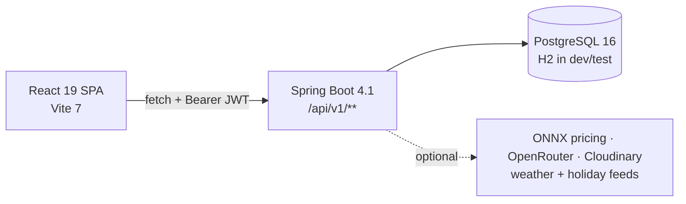

<div align="center">
  <h1>TurfChai</h1>
  <p><em>Book a turf, run a tournament, or find a pickup game — in Dhaka.</em></p>

<a href="#"></a>
<a href="#"></a>
<a href="#"></a>
<a href="#"></a>

</div>

---

## Overview

TurfChai is a full-stack booking platform for sports turfs. Players find a
pitch, hold a slot, pay and review it. Venue owners publish their pitches, price
them, run promotions and see their trade. Hosts reserve pitches across a day and
run a tournament on them. Administrators verify venues, moderate the platform
and settle owner payouts.

It is a working product, not a prototype: **145 REST endpoints**, **30 entities**,
**34 database migrations**, and a test gate that drives the running system rather
than the source.

## The problem

Booking a turf in Dhaka happens over phone calls and messages. Availability is
whatever the owner remembers, double-bookings are settled by argument, prices are
quoted ad hoc, and a player with no team simply does not play. Owners have no
record of their trade beyond a notebook.

## The solution

One system where availability is authoritative, a slot can be held while you pay,
money is recorded per tender and refunded by the venue's own policy, and a player
without a team can join somebody else's game.

## Who uses it

| Role                | What they do                                                                                                                                                                     |
| ------------------- | -------------------------------------------------------------------------------------------------------------------------------------------------------------------------------- |
| **Player**          | Discover venues, hold and book slots, pay with wallet credit and promo codes, manage and cancel bookings, review venues, earn rewards, join open games, register for tournaments |
| **Venue owner**     | Set up venues and pitches, generate slots, price by sport and time window, run promotions, manage bookings and customers, check players in, answer reviews, read their ledger    |
| **Tournament host** | Reserve pitches across a day, take team registrations, track entry fees, generate a knockout bracket                                                                             |
| **Administrator**   | Verify venue submissions, moderate venues and accounts, appoint admins, settle payouts, read the audit trail — behind two-factor sign-in                                         |

## What it does

- **Discovery** — paged catalogue with map and list views, filters and sorting
- **Availability** — 5-minute exclusive slot holds, live over Server-Sent Events
- **Booking and checkout** — one transaction covering discount, wallet, payment rows, confirmation and points
- **Cancellation and refunds** — policy snapshotted at confirmation, refunded per tender
- **Reviews** — verified against a played booking; venue rating recomputed on write
- **Rewards** — points, tiers, wallet credit, redeemable catalogue
- **Notifications** — written by the backend service that performs each state change
- **Open games** — post or join a pickup game, with capacity and reliability rules
- **Tournaments** — multi-pitch reservation, registrations, entry fees, knockout bracket
- **Owner console** — dashboard, calendar, bookings, customers, promotions, payments, reviews
- **Admin console** — 2FA, analytics, verification queue, moderation, payouts, audit log

Full inventory: **[docs/features.md](docs/features.md)**

## Architecture



A single-page frontend talking to a layered Spring Boot API. The acting user
always comes from the JWT, ownership is checked per row in the service layer,
and contended rows (slots, promo codes, game capacity) are protected with
pessimistic locks.

Details: **[docs/architecture.md](docs/architecture.md)** ·
**[docs/database.md](docs/database.md)** · **[docs/api.md](docs/api.md)**

## Technology

**Backend** — Java 21, Spring Boot 4.1 (Web MVC, Data JPA, Security,
Validation), JWT + BCrypt, Flyway, ONNX Runtime, a hand-rolled
`com.turfchai.ai` module for RAG and tool calling.

**Frontend** — React 19.2, Vite 7, React Router 7, plain CSS with design tokens,
Chart.js, Leaflet, `qrcode`. Six runtime dependencies in total.

**Database** — PostgreSQL 16 in production, in-memory H2 for `dev`/`test`.

**Testing** — JUnit 5 + Mockito + Spring Boot Test, Vitest + Testing Library,
Playwright, and PowerShell/Node probes that drive the live API.

## Project structure

```
TurfChai/
├── src/main/java/com/turfchai/    backend — feature packages + older layer packages
├── src/main/resources/
│   ├── db/migration/              34 Flyway migrations
│   ├── ai-knowledge/              RAG corpus for the assistant
│   └── ml_models/                 ONNX pricing model
├── src/test/java/                 65 backend test classes
├── frontend/
│   ├── src/                       pages, components, hooks, api clients, routes
│   ├── e2e/                       Playwright specs
│   └── qa/                        live journey, flow, crawl and a11y probes
├── qa/                            the gate (run-qa.ps1) + live API probes
├── scripts/                       CI smoke test, load test, DB setup
├── machine-learning/              pricing model training
├── docs/                          this documentation set
└── Dockerfile · render.yaml       deployment
```

## Getting started

The `dev` profile runs on in-memory H2 with demo data — no database setup:

```bash
# terminal 1 — backend on :8080
./mvnw spring-boot:run -Dspring-boot.run.profiles=dev

# terminal 2 — frontend on :5173
cd frontend && npm install && npm run dev
```

Sign in as `rafi@turfchai.dev` / `demo1234`.

Full instructions, PostgreSQL setup, demo accounts and troubleshooting:
**[docs/setup.md](docs/setup.md)**

## Environment configuration

`.env.example` is the template; `.env` is gitignored. Every variable has a
working local default except the optional integrations (`OPENROUTER_API_KEY`,
`CLOUDINARY_URL`, SMTP). `JWT_SECRET` must be set in production and
`OTP_EXPOSE_DEV_CODE` must be `false`.

Full table: **[docs/setup.md](docs/setup.md#environment-configuration)**

## Testing

```powershell
pwsh qa/run-qa.ps1        # backend, frontend, live API and browser — one command
```

Most recent verified run: **492 backend tests**, **127 frontend component
tests**, **140 role-matrix checks**, **27 API contract checks**, **27 regression
checks (TC-001…TC-032)**, **23 adversarial checks** — all passing, plus lint,
the honesty scan and the production build.

What each layer proves, and the browser-stage caveat:
**[docs/testing.md](docs/testing.md)**

## API overview

**145 REST endpoints** across 38 controllers, all under `/api/v1` except the AI
assistant (`/api/ai`) and actuator health. Responses are JSON; authenticated
calls carry `Authorization: Bearer <jwt>`.

| Domain         | Examples                                                                                           |
| -------------- | -------------------------------------------------------------------------------------------------- |
| Authentication | `POST /auth/register`, `/auth/login`, `/auth/refresh-token`, admin `/admin/auth/login` + `/verify` |
| Discovery      | `GET /venues`, `/venues/{slug}`, `/venues/{slug}/slots`, `/venues/{slug}/reviews`                  |
| Booking        | `POST /bookings/hold`, `GET /bookings`, `/bookings/{code}`, `POST /bookings/{code}/cancel`         |
| Payments       | `POST /payments/checkout`, `GET /payments/history`                                                 |
| Promotions     | `POST /promotions/validate-code`, owner CRUD under `/owner/promotions`                             |
| Rewards        | `GET /rewards/products`, `/rewards/tiers`, `POST /rewards/redeem`                                  |
| Open games     | `GET /open-games`, `POST /open-games`, `POST /open-games/{id}/join`                                |
| Tournaments    | player `/tournaments/**`, host `/host/tournaments/**`                                              |
| Owner          | `/owner/venues/**`, `/owner/bookings/**`, `/owner/reviews/**`, `/owner/payments/**`                |
| Admin          | `/admin/venues/**`, `/admin/users/**`, `/admin/payouts/**`, `/admin/turf-requests/**`              |

Public without a token: registration, login, OTP, venue catalogue and detail,
slots, venue reviews, open-game reads, the reward catalogue, promo-code
validation and the AI chat. Everything else requires authentication, and
`/admin/**` and `/owner/**` are additionally role-gated.

Swagger UI is served at `/swagger-ui/index.html` to `ADMIN` and above.

Every endpoint, grouped by domain: **[docs/api.md](docs/api.md)**

## Security

- Stateless JWT with BCrypt password hashing; admin sign-in additionally
  requires a single-use, TTL-bound one-time code, throttled to 5 per 15 minutes
- Three authorization layers: URL patterns, `@PreAuthorize`, and per-row
  ownership checks in services
- The acting user is never read from a request body
- A resource you may not see returns 404, so ids cannot be enumerated
- Server-side pricing — the client sends a promo code, never an amount
- No secrets in the repository; `.env` is ignored and `.env.example` holds
  placeholders only

Details and the role matrix:
**[docs/architecture.md](docs/architecture.md#4-authentication-and-authorization)**

## Deployment

`render.yaml` deploys the backend to Render as a Docker container, running
Flyway against a managed PostgreSQL instance; the frontend is built with
`npm run build` and served from Vercel. `.github/workflows/ci.yml` runs the
backend and frontend builds against a PostgreSQL 16 service container.

Production requires `JWT_SECRET`, a real datasource, and
`OTP_EXPOSE_DEV_CODE=false`.

## Known limitations

TurfChai **records** payments; it does not collect them — there is no gateway
integration, and the UI never claims otherwise. Document storage, split
payments, password reset, session revocation and booking reschedule are not
implemented and are shown as unavailable rather than faked. Email, image upload,
the AI assistant and ML pricing are real integrations that stay inert without
their keys.

The full list, honestly separated into _not implemented_, _partially
implemented_ and _operational_: **[docs/decisions.md](docs/decisions.md#part-2--known-limitations)**

## Future roadmap

**Before any real deployment** — integrate a payment gateway behind the existing
`PaymentService` boundary; set `OTP_EXPOSE_DEV_CODE=false` and configure SMTP so
admin codes are delivered out of band; configure `CLOUDINARY_URL` so venue
photos and documents persist; rotate `JWT_SECRET` into a platform secret store.

**Next** — gate the tournament workspace on the `HOST` role (or drop the role);
password change and reset; real document storage for venue verification;
refresh-token rotation so sessions survive expiry.

**Later** — owner-scheduled payouts, league and group tournament formats,
player-to-player invitations on the existing open-game roster, push
notifications, and retraining the pricing model on real booking data.

Full P0–P3 breakdown: **[docs/decisions.md](docs/decisions.md#part-3--roadmap)**

## Capstone summary

**Objective** — build a complete, honest, multi-role booking platform rather
than a demo that looks finished.

**What makes it technically meaningful**

- **Correctness under concurrency** — slot holds, promo redemption and game
  capacity are protected by row locks and proven by tests that race real
  transactions (12 concurrent redemptions of a limit-3 code grant exactly three).
- **A money model that reconciles** — payments are per tender, refunds return
  gateway money to the gateway and wallet credit to the wallet, and a live probe
  asserts the ledger equals the booking.
- **Security treated as behaviour, not configuration** — identity from the
  token, per-row ownership, indistinguishable 404s, and a regression suite that
  re-proves every historical vulnerability against a running server.
- **Honesty enforced by tooling** — a build stage fails if a `catch` reports
  success it did not earn; controls that cannot work are disabled with a stated
  reason; metrics with no data show "—" instead of a plausible number.
- **Product judgement** — surfaces that advertised unbuilt software were removed
  rather than left to pad the feature count.

**Engineering challenges** — reconciling split-tender refunds; making a promo
code safe under concurrent checkout; keeping a stored venue rating consistent
across five surfaces; distinguishing "no data" from "zero" everywhere a number
is shown.

Decisions, trade-offs and roadmap: **[docs/decisions.md](docs/decisions.md)**

---

## Documentation

| Document                                         | Contents                                                             |
| ------------------------------------------------ | -------------------------------------------------------------------- |
| [docs/features.md](docs/features.md)             | Every implemented feature, by role, with its code locations          |
| [docs/architecture.md](docs/architecture.md)     | Frontend, backend, request lifecycle, auth, error handling           |
| [docs/database.md](docs/database.md)             | Entities, ER diagram, migrations, seed data                          |
| [docs/api.md](docs/api.md)                       | All 145 endpoints by domain                                          |
| [docs/user-flows.md](docs/user-flows.md)         | Booking, cancellation, review, promotion, tournament, admin journeys |
| [docs/setup.md](docs/setup.md)                   | Local setup, environment variables, troubleshooting                  |
| [docs/testing.md](docs/testing.md)               | Test layers, principles and verified counts                          |
| [docs/decisions.md](docs/decisions.md)           | Engineering decisions, limitations, roadmap                          |
| [TESTING.md](TESTING.md)                         | Per-layer commands and the gate's stage list                         |
| [DATABASE_SCHEMA.md](DATABASE_SCHEMA.md)         | Original design-time SQL schema (superseded by docs/database.md)     |
| [SWAGGER_E2E_TESTING.md](SWAGGER_E2E_TESTING.md) | Manual API walkthrough                                               |

## License

Copyright © 2026 TurfChai. All rights reserved.
