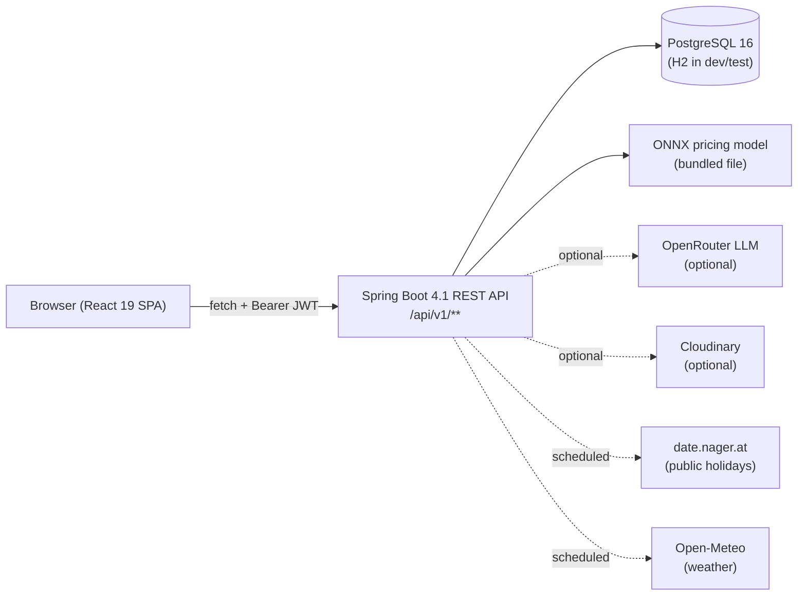
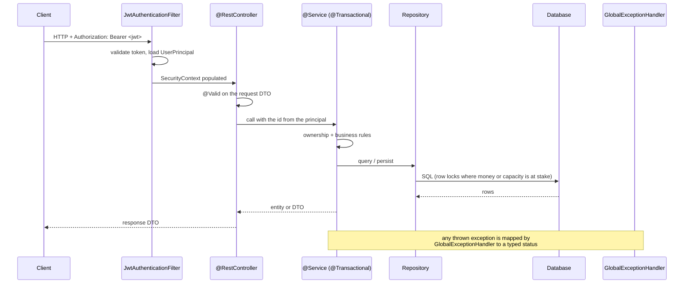
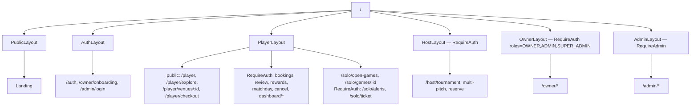
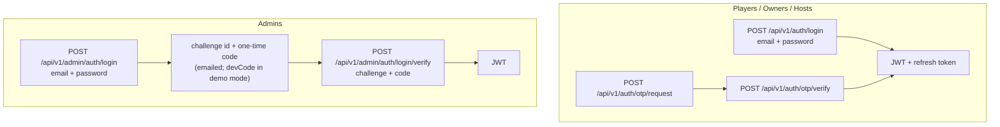

# TurfChai — Architecture

How the system is put together and how a request travels through it.
Everything below is taken from the code in this repository.

---

## 1. System shape



The frontend is a single-page app. It never talks to the database; every read
and write goes through the REST API. There is no server-side rendering and no
backend-for-frontend layer.

The four external services are all optional or non-blocking:

| Service                      | Used for                               | If unavailable                                                               |
| ---------------------------- | -------------------------------------- | ---------------------------------------------------------------------------- |
| ONNX Runtime (bundled model) | Dynamic price quote                    | `/pricing/quote` answers 503; booking still works at the slot's stored price |
| OpenRouter                   | AI chat assistant                      | Chat replies with a fallback provider message                                |
| Cloudinary                   | Photo upload                           | Upload fails honestly; no photo is attached                                  |
| date.nager.at / Open-Meteo   | Holiday + weather features for pricing | Features default; pricing still returns a quote                              |

---

## 2. Backend architecture

### Package layout

The backend mixes two organisational styles, which is worth knowing before
navigating it:

- **Feature packages** — `com.turfchai.booking`, `.payment`, `.venue`,
  `.tournament`, `.promotion`, `.reward`, `.pricing`, `.media`, `.ai`,
  `.admin.auth`, `.player`. Each holds its own `api/`, `service/`,
  `repository/`, `entity/`, `dto/`.
- **Layer packages** — `com.turfchai.controller`, `.service`, `.repository`,
  `.model`, `.dto`, `.domain`. These hold the older classes that were written
  before the feature packages existed.

Both styles are live. When looking for a class, check the feature package first.

```
com.turfchai
├── booking/          slots, holds, bookings, reminders
├── payment/          checkout, refunds, owner payment reports
├── venue/            venues, pitches, pricing rules, search
├── tournament/       tournaments, teams, fixtures, reservations
├── promotion/        promo codes, redemption
├── reward/           points, tiers, wallet, redemptions
├── pricing/          ONNX inference, weather + holiday features
├── media/            Cloudinary upload
├── ai/               chat agent, tools, prompts, RAG knowledge
├── admin/auth/       admin 2FA login
├── player/           player profile + stats
├── security/         JWT filter, UserPrincipal, role helpers
├── config/           security, CORS, OpenAPI, scheduling
├── exception/        GlobalExceptionHandler + typed exceptions
├── controller/       older controllers (auth, admin, reviews, notifications…)
├── service/          older services (reviews, notifications, analytics, seeders)
├── repository/       older repositories
├── model/            older entities + enums
└── domain/           Review entity
```

### Request lifecycle



Three rules hold across the backend:

1. **The acting user comes from the token, never from the request body.**
   Controllers resolve `UserPrincipal` and pass its id down. Where a DTO still
   carries a `userId` field it is explicitly ignored (see `ReviewDto.userId`,
   marked `@Deprecated`).
2. **Ownership is checked in the service, not the controller.** For example
   `BookingService.getBooking` throws `BookingNotFoundException` — not a
   403 — when the caller does not own the booking, so booking ids cannot be
   enumerated by comparing status codes.
3. **Errors are typed.** `GlobalExceptionHandler` maps each exception class to
   a status and a single error envelope. Controllers do not build error bodies.

### Transactions and locking

Money and capacity are protected with pessimistic row locks rather than
optimistic retries:

| Operation                                         | Lock                | Why                                                |
| ------------------------------------------------- | ------------------- | -------------------------------------------------- |
| `SlotRepository.findByIdForUpdate`                | `PESSIMISTIC_WRITE` | Two players cannot hold or book the same slot      |
| `PromotionRepository.findByVenueAndCodeForUpdate` | `PESSIMISTIC_WRITE` | A usage-limited promo code cannot be over-redeemed |
| `OpenGameRepository.findWithLockById`             | `PESSIMISTIC_WRITE` | A game cannot be filled past capacity              |

`PaymentService.pay` runs the whole checkout — booking, discount, payment rows,
wallet debit, confirmation, points — in one transaction. If any step fails,
nothing is written.

### Scheduled jobs

`@EnableScheduling` lives in `config/SchedulingConfig`.

| Job                              | Schedule       | Purpose                                                         |
| -------------------------------- | -------------- | --------------------------------------------------------------- |
| `SlotHoldCleanupJob`             | every 30 s     | Releases slot holds that expired without payment                |
| `BookingReminderJob`             | hourly, at :05 | Notifies players about a confirmed booking starting within 24 h |
| `DailyWeatherSyncScheduler`      | daily 00:01    | Pulls a 14-day forecast grid used as a pricing feature          |
| `HolidaySyncScheduler`           | monthly, 1st   | Pulls Bangladesh public holidays used as a pricing feature      |
| `SlotEventBroadcaster` heartbeat | fixed rate     | Keeps the slot SSE stream alive                                 |

### Real-time

`GET /api/v1/venues/{venueId}/slots/stream` is a Server-Sent Events endpoint.
`SlotEventBroadcaster` publishes `SlotStatusChangedEvent` **after the
transaction commits**, so a client is never told a slot is booked before the row
is durable. The venue page overlays these events on the last snapshot and lets a
refetch win, so the two sources cannot drift permanently.

---

## 3. Frontend architecture

### Structure

```
frontend/src
├── api/          one module per backend domain; all fetch goes through client.js
├── components/   shared UI (buttons, cards, forms, modals, navigation, charts)
├── context/      SessionContext, ThemeContext, ToastContext, SidebarContext
├── hooks/        useApi, useSession, useDisclosure, useToast, …
├── layouts/      PublicLayout, AuthLayout, PlayerLayout, OwnerLayout,
│                 HostLayout, AdminLayout
├── pages/        player/, owner/, admin/ screens
├── solo/         open games, game detail, LFG alerts, ticket
├── host/         tournament workspace, multi-pitch, reserve
├── routes/       AppRoutes.jsx (all routes) + paths.js (all URLs)
├── constants/    navigation models
├── styles/       plain CSS with design tokens
└── utils/        formatting, error messages, device actions
```

### Routing and guards

Every URL is declared once in `routes/paths.js`; components never hard-code a
path string. `AppRoutes.jsx` composes layouts and guards:



Browsing is deliberately public — catalogue, venue detail and checkout render
for a signed-out visitor (checkout shows a "sign in to confirm" state rather
than personal data). Everything that identifies a user sits behind `RequireAuth`.

### Data fetching

There is no Redux/Zustand/React-Query. State is React state plus two custom
pieces:

- **`api/client.js`** — the single fetch wrapper. Attaches the bearer token,
  unwraps the backend's `ApiResponse<T>` envelope where used, throws a typed
  `ApiError` carrying `status` and the server's message, and clears the session
  on 401.
- **`hooks/useApi.js`** — wraps a call in `{ data, loading, error, reload }`,
  with optional polling. Every screen renders three states explicitly: loading,
  error (with a retry), and empty.

`SessionContext` holds the signed-in user so the shell and pages share one
identity object rather than each fetching `/me`.

### Honesty rules enforced in the frontend

Two rules are enforced by tooling rather than convention:

- `frontend/scan-honesty.mjs` (a gate stage) fails the build if a `catch`
  block swallows a failure and reports success anyway. Deliberate exceptions
  are allowlisted with a reason.
- A control that cannot work is `disabled` with a `title` explaining why, rather
  than showing a toast that implies success. There are 12 such controls.

---

## 4. Authentication and authorization

### Two login paths



Admin sign-in always requires the second factor. Challenges are single-use,
expire on a TTL, and are throttled to 5 per user per 15 minutes
(`AdminAuthServiceImpl`).

Passwords are hashed with BCrypt. Tokens are stateless JWTs, so "sign out"
clears the client — there is no server-side session to revoke, and the admin UI
says so instead of offering a revoke button that would do nothing.

### Authorization layers

1. **URL level** — `SecurityConfig` requires `ADMIN`/`SUPER_ADMIN` for
   `/api/v1/admin/**` and `OWNER`/`ADMIN`/`SUPER_ADMIN` for `/api/v1/owner/**`;
   everything not explicitly permitted is `authenticated()`.
2. **Method level** — `@PreAuthorize` on controllers that need a narrower rule.
3. **Row level** — services verify the caller owns the row
   (`requireOwnership`, `canAccess`). This is the layer that stops one owner
   reading another owner's venue, or one player reading another player's booking.

Public (no token) endpoints are limited to: register, login, OTP request/verify,
refresh-token, check-email, health, the venue catalogue and venue detail, venue
slots and the slot stream, venue reviews, open-game reads, reward products and
tiers, promo-code validation and the AI chat.

### Role matrix

| Capability                                   | PLAYER | SOLO_PLAYER | HOST | OWNER | ADMIN / SUPER_ADMIN |
| -------------------------------------------- | :----: | :---------: | :--: | :---: | :-----------------: |
| Browse venues, read reviews                  |   ✓    |      ✓      |  ✓   |   ✓   |          ✓          |
| Hold slot, book, pay                         |   ✓    |      ✓      |  ✓   |   ✓   |          ✓          |
| Cancel own booking, get refund               |   ✓    |      ✓      |  ✓   |   ✓   |          ✓          |
| Review own played booking                    |   ✓    |      ✓      |  ✓   |   ✓   |          ✓          |
| Earn/redeem points, wallet                   |   ✓    |      ✓      |  ✓   |   ✓   |          ✓          |
| Post / join open games                       |   ✓    |      ✓      |  ✓   |   ✓   |          ✓          |
| Register for a tournament                    |   ✓    |      ✓      |  ✓   |   ✓   |          ✓          |
| Create/manage a tournament                   |   ✓    |      ✓      |  ✓   |   ✓   |          ✓          |
| Manage venues, pitches, slots, promotions    |   ✗    |      ✗      |  ✗   |   ✓   |          ✓          |
| See venue bookings, customers, payments      |   ✗    |      ✗      |  ✗   |   ✓   |          ✓          |
| Reply to a review on own venue               |   ✗    |      ✗      |  ✗   |   ✓   |          ✓          |
| Approve turf requests, moderate venues/users |   ✗    |      ✗      |  ✗   |   ✗   |          ✓          |
| Settle/flag payouts, read audit log          |   ✗    |      ✗      |  ✗   |   ✗   |          ✓          |
| Appoint admins, change permissions           |   ✗    |      ✗      |  ✗   |   ✗   |          ✓          |

`HOST` is a role value on the user record; the tournament workspace is reachable
by any authenticated user, so hosting is not gated by the role today. See
[decisions.md](decisions.md#known-limitations).

---

## 5. Error handling

`GlobalExceptionHandler` produces one envelope for every failure:

```json
{
  "error": "Unprocessable Entity",
  "message": "…",
  "timestamp": "…",
  "status": 422
}
```

| Exception                                                                                                                         | Status                       |
| --------------------------------------------------------------------------------------------------------------------------------- | ---------------------------- |
| `MethodArgumentNotValidException`, `IllegalArgumentException`                                                                     | 400                          |
| `UnauthenticatedException`                                                                                                        | 401                          |
| `AccessDeniedException`                                                                                                           | 403                          |
| `*NotFoundException` (booking, venue, review, open game, user)                                                                    | 404                          |
| `SlotUnavailableException`, `IllegalStateException`, `TournamentConflictException`, `AlreadyJoinedException`, `GameFullException` | 409                          |
| `PromotionRejectedException`                                                                                                      | 422                          |
| anything else                                                                                                                     | 500, logged, generic message |

The frontend surfaces `message` verbatim, so backend wording is user-facing.

---

## 6. Validation

- **Request DTOs** use Bean Validation (`@NotNull`, `@Size`, `@Min`, `@Max`,
  `@Pattern`, `@DecimalMin`) and controllers apply `@Valid`.
- **Entities** carry the same bounds where the database enforces them, so a
  value that slips past a DTO cannot corrupt a row. Where the two disagreed the
  DTO was corrected — for example `CreateOpenGameRequest.minimumReliability` now
  mirrors the entity's `0..100`, because without it an out-of-range value passed
  validation and failed at persist time as a 500.
- **Server-side pricing** — the client sends a promo _code_, never an amount.
  `PaymentService` prices the discount from the slot price it holds.
