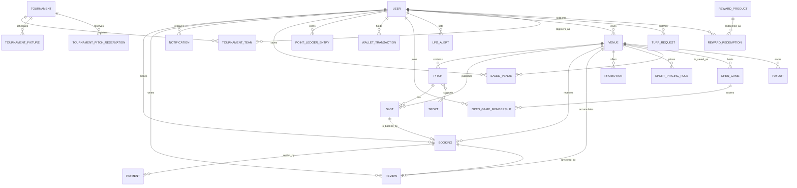

# TurfChai — Database

**30 JPA entities**, **34 Flyway migrations** (`V1`…`V33`, plus a repeatable
baseline), **19 enums**. PostgreSQL 16 in production; H2 in-memory for the `dev`
and `test` profiles.

`DATABASE_SCHEMA.md` at the repository root holds the raw SQL definitions. This
page explains the model.

---

## Entity map

---

## Core entities

### `users`

Every actor. `role` is one of `PLAYER`, `SOLO_PLAYER`, `HOST`, `OWNER`, `ADMIN`,
`SUPER_ADMIN`. Carries `passwordHash` (BCrypt), `publicId` (the JWT subject, so
the numeric id is never in a token), `reliabilityScore` (used as the open-game
bar), `signupChannel` (feeds admin acquisition analytics) and profile fields.

### `venues`

Owned by a user. Holds identity (`slug`, `name`, `area`, `address`, `lat`,
`lng`), operations (`openTime`, `closeTime`, `amenities_csv`, `rules`,
`cancelPolicy`, `depositPolicy`, `basePrice`), lifecycle (`status`,
`is_verified`) and reputation (`rating_avg`, `review_count`, `saved_count`).

`rating_avg` and `review_count` are **stored columns**, recomputed by
`ReviewService.recalculateVenueRating` whenever a review is written. Every
surface that shows a rating reads these columns, so search results, the venue
page and the owner console cannot disagree.

### `pitches`

A playing field inside a venue: `name`, `format`, `surfaceType`, `lighting`,
`maxPlayers`, `isIndoor`, and a many-to-many to `sports`.

### `slots`

The bookable unit: `venue_id`, `pitch_id`, `slot_date`, `start_time`,
`end_time`, `price`, `status`, plus `held_by_user_id` and `hold_expires_at`.
`status` ∈ `AVAILABLE`, `HELD`, `BOOKED`, `BLOCKED`.

This is the row every concurrency guarantee rests on. It is read with
`PESSIMISTIC_WRITE` (`findByIdForUpdate`) for every hold, confirm, cancel and
block, so two players cannot take the same slot.

### `bookings`

`bookingCode` (human reference), `slot`, `userId`, `venueId`, `pitchId`,
`bookingDate`, `startTime`, `endTime`, `status`, and the money:
`grossAmount`, `discountAmount`, `promoCode`, `netAmount`. Also
`cancelPolicySnapshot` — the venue's cancellation terms **pinned at
confirmation**, so a later policy change cannot alter an existing booking's
refund, and `checkedInAt`.

`status` ∈ `PENDING`, `CONFIRMED`, `CANCELLED`, `COMPLETED`.

### `payments`

One row per tender. A booking part-paid from the wallet writes two rows, so the
ledger reconciles against the booking total. Fields: `txnReference`, `userId`,
`bookingId`, `type` (`BOOKING` / `REFUND`), `amount`, `method`, `provider`,
`status`, `isRewardWalletPayment`, `refundOfPaymentId`, `paidAt`.

Refunds are recorded **by tender**: gateway money returns to the gateway leg and
wallet credit returns to the wallet.

### `reviews`

One per `(booking_id, user_id)` — enforced by a unique constraint, so the
duplicate rule is a database guarantee, not just a service check. Holds
`overallRating` (1–5, DB check constraint), `subRatings` (JSON), `comment`,
`tags`, `status`, and the owner's public reply (`ownerResponse`,
`ownerRespondedAt`).

### `promotions`

Venue-scoped codes: `code`, `discountType` (`PERCENT`/`FLAT`), `discountValue`,
`minOrderAmount`, `maxDiscountAmount`, `validFrom`, `validUntil`, `usageLimit`,
`usageCount`, `active`. Unique on `(venue_id, code)`.

`validFrom` defaults to the current time **truncated to the second** — an
untruncated value could be rounded forward by the timestamp column, leaving a
freshly published code rejected as "not yet active".

### `notifications`

`userId`, `type`, `title`, `body`, `link`, `isRead`, `createdAt`. Written by the
service that performs the state transition. Deduplicated on
`(userId, type, link)` so a retried transition or a repeated scheduler sweep
cannot stack duplicates.

---

## Supporting entities

| Entity                                                                                    | Purpose                                                       |
| ----------------------------------------------------------------------------------------- | ------------------------------------------------------------- |
| `sports`, `sport_pricing_rules`                                                           | Sport registry and per-window pricing per venue               |
| `saved_venues`                                                                            | A player's shortlist                                          |
| `point_ledger_entries`, `loyalty_tiers`, `reward_products`, `reward_redemptions`          | The loyalty economy                                           |
| `wallet_transactions`                                                                     | Wallet credit movements                                       |
| `open_games`, `open_game_memberships`                                                     | Solo pickup games and their rosters                           |
| `lfg_alerts`                                                                              | Standing "looking for game" alerts                            |
| `tournaments`, `tournament_teams`, `tournament_fixtures`, `tournament_pitch_reservations` | The tournament ecosystem                                      |
| `turf_requests`                                                                           | Owner venue-verification submissions                          |
| `payouts`                                                                                 | Owner settlements, with `platformFee` at the 6% platform rate |
| `audit_logs`                                                                              | Admin action trail                                            |
| `admins`                                                                                  | Admin records and permissions                                 |
| `holidays`, `weather_forecast_grid`                                                       | Feature inputs for the ML pricing model                       |

---

## Migrations

`src/main/resources/db/migration`, 34 files. Flyway runs them on boot against
PostgreSQL.

- `V1__baseline.sql` creates the full original schema.
- Later migrations are additive: the booking slot engine (`V7`), the active-slot
  unique constraint (`V9`), column widenings (`V23`), promotions on bookings
  (`V33`), and so on.
- **Historical migrations are never edited.** Flyway validates checksums, so a
  change to an applied migration breaks every existing database. Where a feature
  was dropped, its columns were left in place rather than rewriting history.

In `dev` and `test` the app uses H2 with `flyway.enabled=false` and
`ddl-auto=update`, so the schema is derived from the entities and the database
is rebuilt on every restart. That means **fixture ids change between runs** —
tests and QA probes discover their subjects at runtime rather than hard-coding
ids.

---

## Seed data

Eight seeders, all guarded with `@Profile({"dev","test","ci"})` so they can
never run against production:

`AdminDataSeeder`, `AdminDemoDataSeeder`, `AdminPartBDataSeeder`,
`SlotDataSeeder`, `PlayerDataSeeder`, `RewardDataSeeder`,
`TournamentDataSeeder`, `VenueDataSeeder`.

They create venues, pitches, slots, players, bookings, reviews, rewards,
tournaments and payouts so the app is demonstrable immediately after boot.
Demo accounts are documented in [setup.md](setup.md#demo-accounts).
