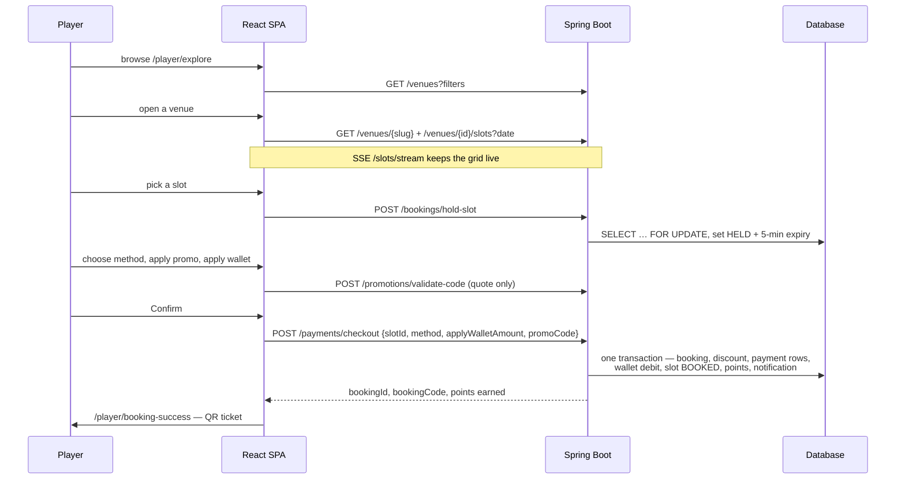
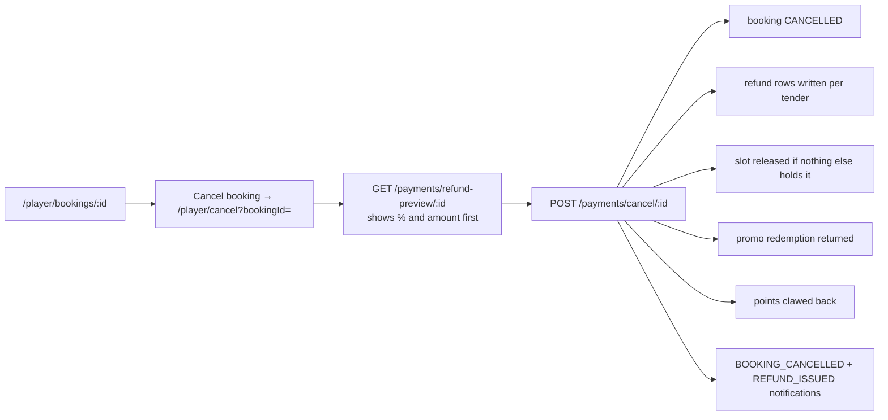
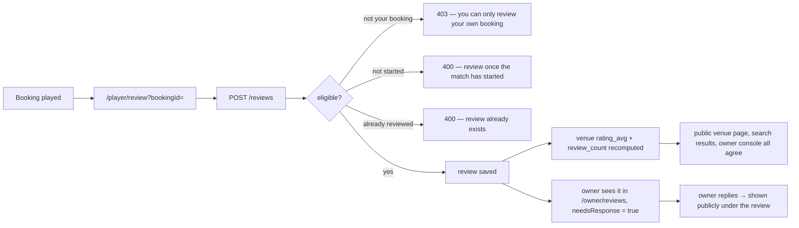
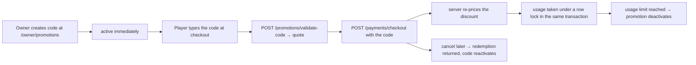
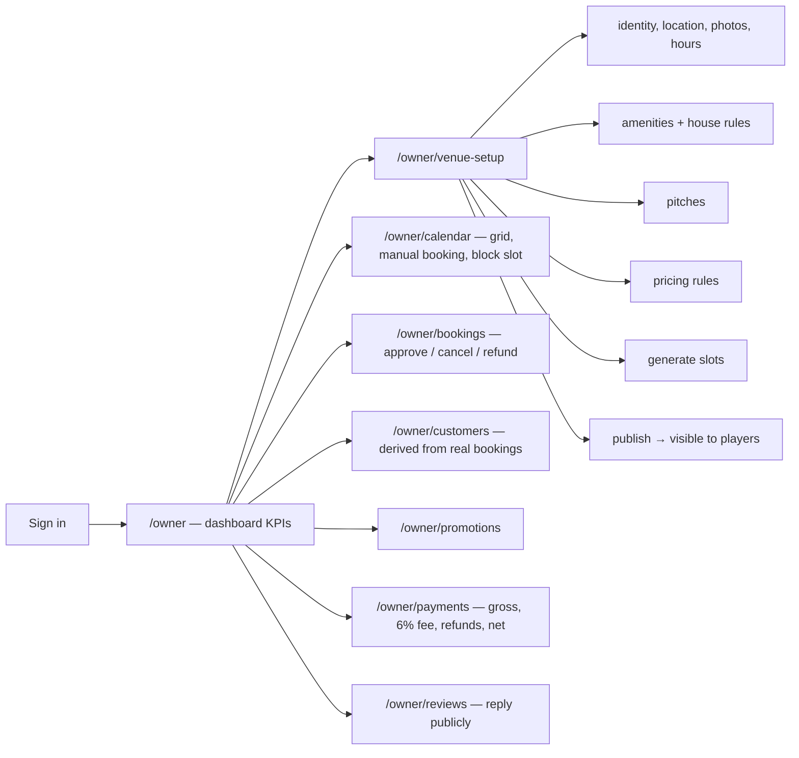
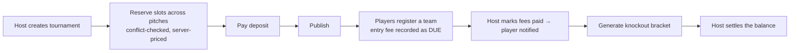
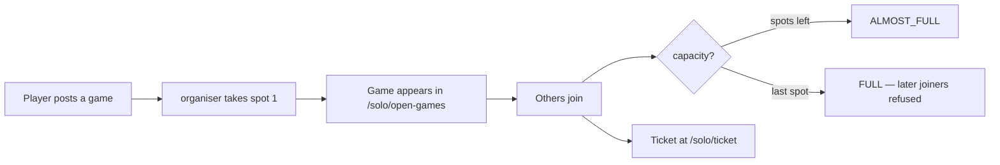
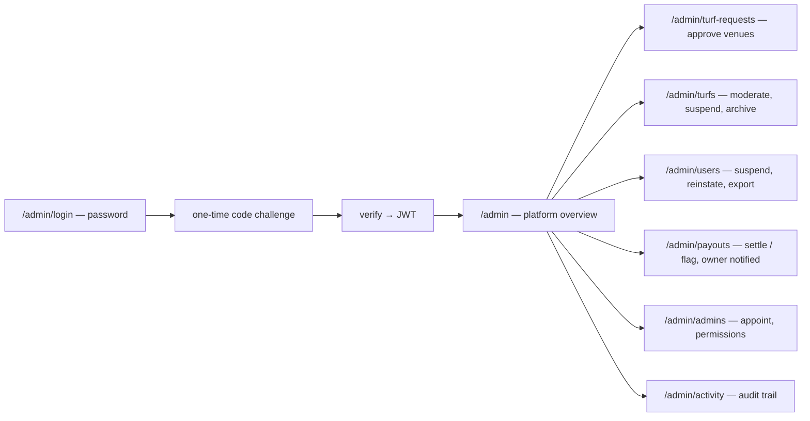
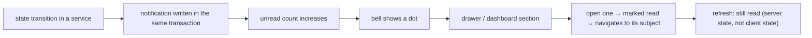

# TurfChai — User Flows

The workflows the product actually supports, as implemented.

---

## 1. Player booking journey

**What is guaranteed**

- The hold is exclusive; a second player is refused with 409.
- The discount is priced from the server's slot price. A client sending its own
  discount amount gets the server's figure.
- The whole checkout is one transaction — a failure writes nothing.
- The cancellation policy is snapshotted onto the booking.

---

## 2. Cancellation and refund journey

Cancellation has exactly one entry point — the confirmation screen — so the
destructive action always shows the refund first. Refunds return gateway money
to the gateway leg and wallet credit to the wallet. A second cancel is refused.

---

## 3. Review journey

---

## 4. Promotion journey

Verified live: 12 concurrent redemptions of a limit-3 code grant exactly three.
A code is scoped to its venue, so it will not apply at another venue.

---

## 5. Owner journey

A new owner starts at `/owner/onboarding`, submits the venue for verification,
and sees a pending-approval state until an admin approves the request.

---

## 6. Tournament journey

One entry per player per tournament. Withdrawal is allowed while the fee is
unpaid. Every amount is computed server-side.

---

## 7. Open game journey

Reliability bars are enforced with the reason returned; joining twice is refused.

---

## 8. Admin journey

Challenges are single-use and throttled to 5 per user per 15 minutes.

---

## 9. Notification journey

A checkout that fails writes its notification in a **separate** transaction, so
the record survives the rollback of the thing that failed.
